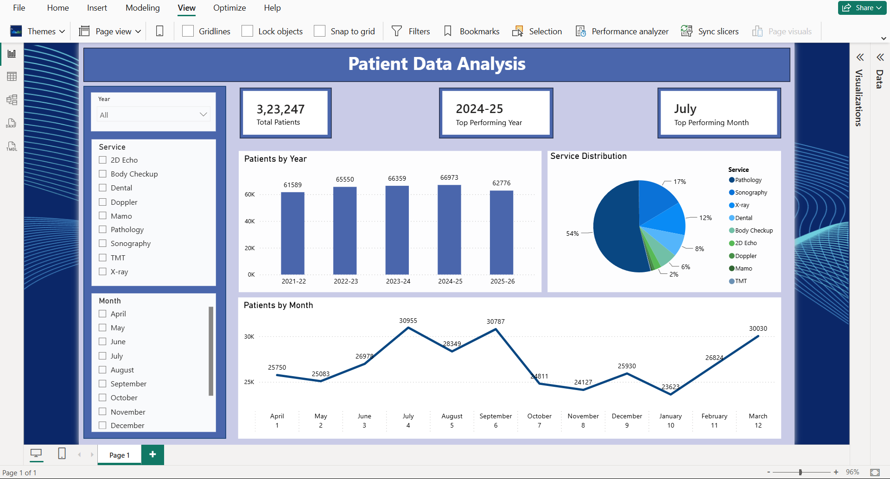

# 🏥 Patient Data Analysis Dashboard

## 📌 Project Overview

This project is an interactive **Patient Data Analysis Dashboard** built using **Microsoft Excel** and **Power BI**. It enables users to analyze patient data by **year, month, and medical service** through interactive visualizations, KPI cards, and slicers.

---

## 📊 Dashboard Preview

---

## ✨ Dashboard Features

- 📌 Total Patients KPI
- 📌 Peak Year KPI
- 📌 Peak Month KPI
- 📊 Year-wise Patient Analysis
- 📈 Monthly Patient Trend
- 🥧 Service Distribution Analysis
- 🎛️ Interactive Year, Month, and Service slicers
- 🔄 Cross-filtering between visuals

---

## 🛠️ Tools & Technologies

- Microsoft Excel
- Power BI Desktop

---

## 📈 Skills Demonstrated

- Data Cleaning
- Data Transformation
- Dashboard Design
- Data Visualization
- KPI Development
- Interactive Reporting

---

## 📂 Repository Contents

- `Dashboard.pbix` – Power BI dashboard
- `Patient_Data.xlsx` – Source dataset
- `Dashboard.png` – Dashboard preview
- `README.md` – Project documentation

---

## 🎯 Key Insights

- Displays the total number of patients using KPI cards.
- Identifies the peak year and peak month based on patient count.
- Compares patient distribution across different medical services.
- Visualizes year-wise patient trends using a column chart.
- Visualizes monthly patient trends using a line chart.
- Supports interactive filtering using Year, Month, and Service slicers.

---

## 👨‍💻 Author

**Mann Damani**

B.Tech Computer Science & Engineering Student | Aspiring Data Analyst

**Skills:** Excel • Power BI • SQL • Python
